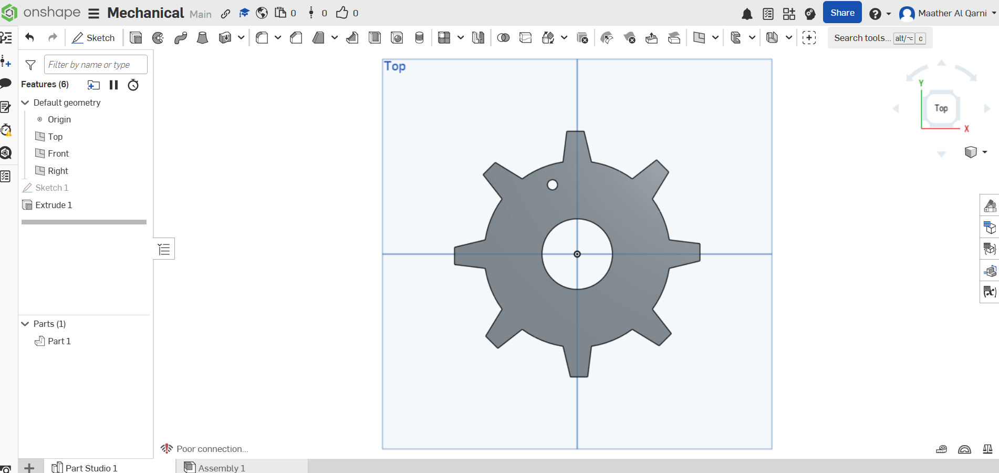

# ⚙️ Mechanical Gear Design

This project presents a 3D gear design created using Onshape.

---

## 📌 Project Description
The purpose of this project is to design a simple mechanical gear.
The gear was created by sketching a base circle and repeating a rectangular shape to form the teeth, followed by extrusion to generate the 3D model.

---

## ⚙️ Design Details
- The gear consists of a circular base with evenly distributed teeth.
- Teeth were created using a repeated rectangular pattern.
- The design was extruded to a thickness of 8 mm.
- Fillet was applied to smooth the edges and improve the final shape.
- The sketch was fully defined to ensure accurate dimensions.

---

## 🛠️ Tools Used
- Onshape (3D Design)
- Sketch Tools
- Extrude Feature
- Fillet Tool

---

## 📷 Design Preview

---

## 🔗 Onshape Link
[Click here to view the design](https://cad.onshape.com/documents/50b34829d3b4a50df06a160a/w/1175cedffdf8e35c389b4954/e/5561be9c366c186b361bfcea)

---

## 🎥 Project Video
[Click here to watch the video](https://drive.google.com/file/d/1_x_T88EsnCMtByr2-_WBunnmbYo7ulbs/view?usp=sharing)

---

## 📁 Files Included
- gear.stl → 3D model file
- gear.png → Design image
- README.md → Project description

